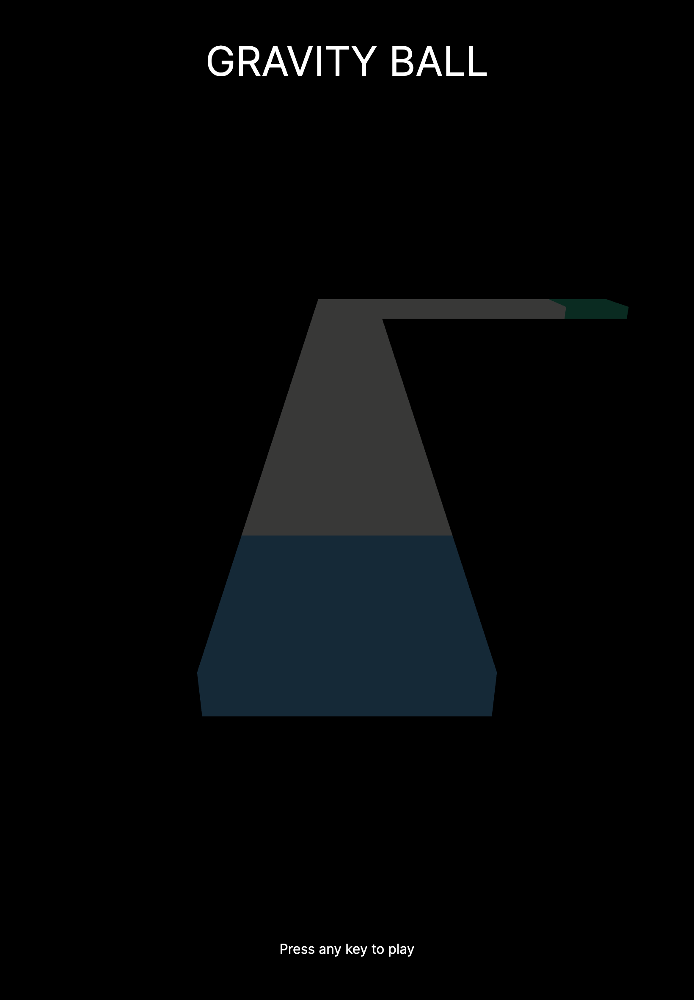
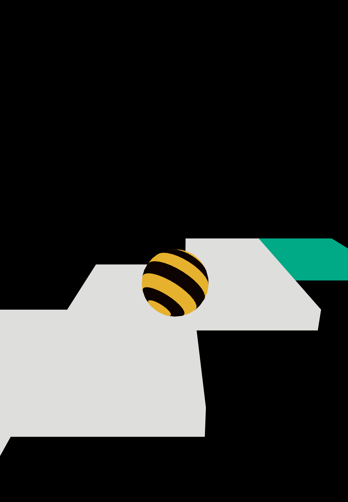

# React-Three 3D Ball Game

## Overview

Welcome to the React-Three 3D Ball Game! This game is developed using **React** and **React-Three** and offers an engaging 3D gaming experience. You can control a ball using your keyboard and even play online with friends.

## Table of Contents

- [Getting Started](#getting-started)
  - [Prerequisites](#prerequisites)
  - [Installation](#installation)
- [How to Play](#how-to-play)
- [Game Features](#game-features)
- [Contributing](#contributing)
- [License](#license)

## Getting Started

### Prerequisites

Before you begin, ensure you have the following prerequisites:

- **Node.js** and **npm** installed on your machine.
- A modern web browser with **WebGL** support for the best gaming experience.

### Installation

Follow these steps to get the game up and running:

1. Clone this repository to your local machine:

   ```bash
   git clone https://github.com/shaddymsz/React-Three-Game.git

   ```

2. Navigate to the project directory:
   ```bash 
   cd React-Three-Game
   ```
   
3. Install the project dependencies:
   ```bash
   npm install
   ```
5. Start the development server:
   ```bash
   npm start
   ```
   
6. Open your web browser and visit http://localhost:3000 to play the game!

### How to Play

- Use the arrow keys on your keyboard to control the ball's movement.
- Navigate the ball through challenging mazes and reach the finish line.
- Invite your friends to play online by sharing the game's URL with them.

### Game Features

- Stunning 3D graphics powered by React-Three.
- Realistic physics simulation for an immersive gaming experience.
- Online multiplayer mode for competing with friends.
- A variety of challenging mazes to test your skills.
- Responsive design for playing on various devices.





### Contributing

I welcome contributions to make this game even better! To contribute:

- Fork this repository on GitHub.
- Create a new branch with a descriptive name for your feature or bug fix.
- Make your changes and commit them with clear and concise messages.
- Push your changes to your fork on GitHub.
- Create a pull request from your fork to this repository, explaining your changes.
